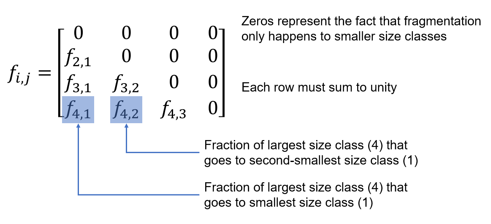
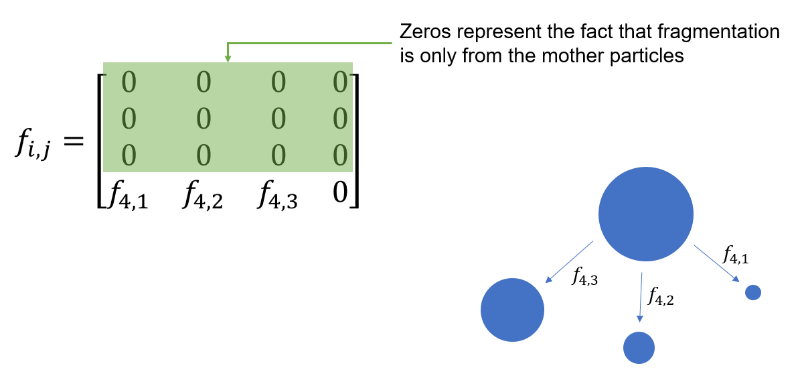
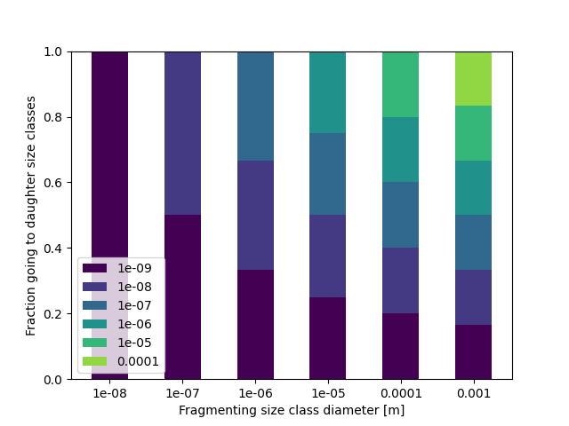
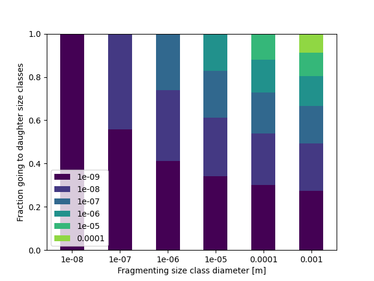

# Fragment size distribution

Fragment size distribution $f_{i,j}$ is an integral part of the model. It defines how polymer fragmented from one size class is distributed to smaller size classes. When compared to the fragmentation rate $k_\text{frag}$:

$k_{\text{frag},i}$
: The fragmentation rate $k_\text{frag},i$ is the rate at which the mass of polymer in size class $i$ is lost from that size class due to fragmentation. For a given period of time $\Delta t$, a mass $m = \Delta t k_{\text{frag},i}$ of polymer fragments from size class $i$. However, this doesn't tell us how much of this mass goes to each daughter (smaller) size class. This information is given by $f_{i,j}$.

$f_{i,j}$
: The fragment size distribution is the fraction of this fragmented *mass* that is transfered from size class $i$ to size class $k$.


## General fragment size distribution matrix

$f_{i,j}$ is a 2D matrix, but as fragmentation only happens from larger to smaller size classes, the matrix is zero everywhere except its lower left triangle. Taking the example of four size classes, with the smallest indexed by 1 and the largest by 4:




## Example - only fragmentation from largest size class

Taking the example of a situation where only the largest size class fragments, the matrix can be simplified to be mostly zeros:



:::{note}
As shown here, the model uses a $f_{i,j}$ matrix with zeros on the diagonal (fragmentation from and to the same size class). For use as a proper mass balance matrix, the diagonal should instead be the fraction of polymer left in that size class after fragmentation, and the fractions to smaller size classes adjusted accordingly.
:::


## Changing the fragment size distribution in the model

The [input data parameter `fsd_beta`](input-data:fsd-beta) controls the depedence of the fragment size distribution on the particle diameters of daughter size classes, such that the distributed masses scales proportionally to $d^\beta$. Thus, if $\beta = 0$ (the default), there is an even split amongst daughter size classes, if $\beta < 0$, a greater proportion of the mass goes to smaller size classes, and if $\beta > 0$, a greater proportion of the mass goes to larger size classes.

The model calculates this internally by:

```python
# Start with a zero-filled array of shape (N,N)
fsd = np.zeros((n, n))
# Fill with the split to daughter size classes scaled
# proportionally to d^beta
for i in np.arange(1, n):
    fsd[i, :-(n-i)] = psd[:-(n-i)] ** beta / np.sum(psd[:-(n-i)] ** beta)
```

For example, using the [example model config and data](../example-usage.ipynb), if $\beta = 0$:



If $\beta = -0.1$:



To change this over and above the $d^\beta$ dependence outlined above, you must generate your own $f_{i,j}$ matrix and directly set the `fsd` variable:

```python
fmnp = FragmentMNP(config, data)
fmnp.fsd = my_fsd_matrix
```

:::{caution}
Currently, no validation is performed on this matrix, and so the model will produce erroneous results if a matrix in which rows don't sum to unity is provided.
:::